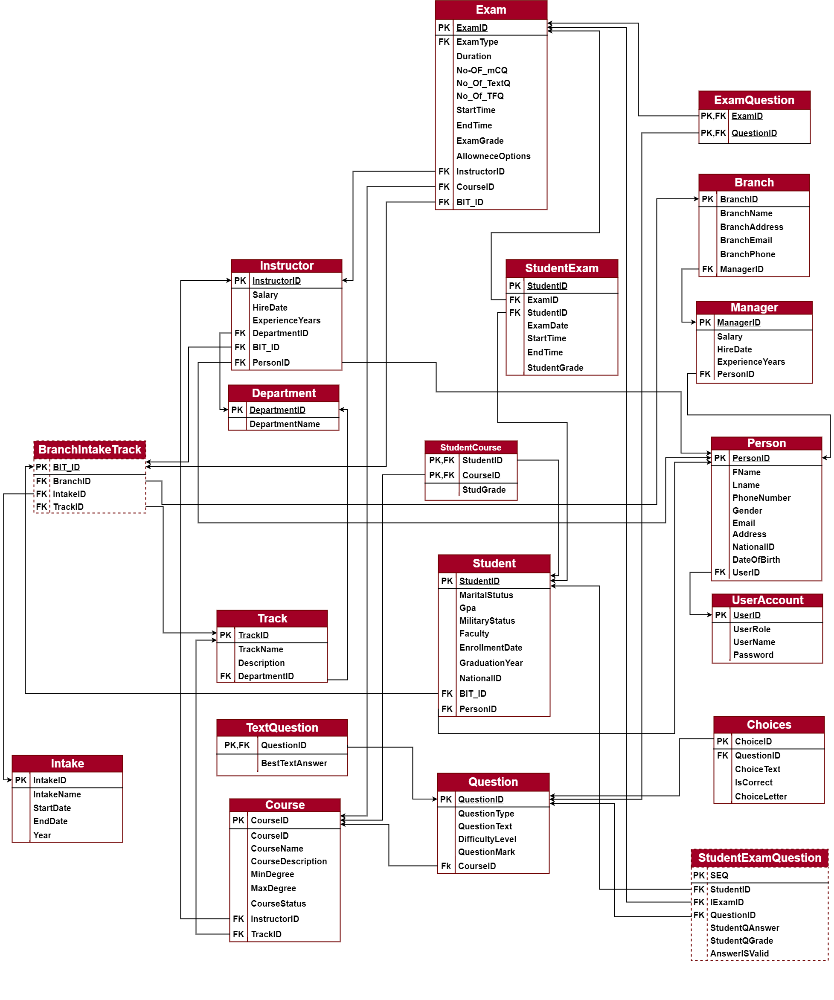

---
# Examination System Database – ITI Project
## Schema

## 📑 Requirements

### ✅ Functional
- **Question Management**: MCQ, TF, Text (auto/semi-auto evaluation).  
- **Exam Management**: Random/manual creation, course linkage, schedules.  
- **Student Access**: Exams visible only within valid time window.  
- **Grading**: Auto for objective Qs, manual/semi-auto for text Qs.  
- **Course/Instructor/Student Management** with related metadata.  

### ⚙️ Non-Functional
- **Normalization** for reduced redundancy.  
- **Indexing** for query optimization.  
- **Filegroups** for scalable storage.  
- **Stored Procedures & Views** for all operations.  
- **Daily Backups** using SQL Server Agent.  

---

## 🗂️ Database Schema

### Main Entities
- **UserAccount** → Login details, roles  
- **Person** → Common info (Name, Email, NationalID, etc.)  
- **Student, Instructor, Manager** → Extended role-specific info  
- **Branch, Department, Track, Intake** → Academic hierarchy  
- **Course** → Course details, min/max degree  
- **Exam** → Exam definition, duration, allowance  
- **Question** → MCQ/TF/Text with difficulty & marks  
- **StudentExam, StudentExamQuestion** → Store results  

### Relationships
- **Person ↔ Roles (1:1)**  
- **Instructor ↔ Course (1:N)**  
- **Course ↔ Exam (1:N)**  
- **Exam ↔ Question (M:N)**  
- **Student ↔ Exam (M:N)**  
- **Student ↔ Course (M:N)**  

---

## 🗃️ Storage Design
- **PRIMARY Filegroup** → Metadata & small tables (UserAccount, Dept., Manager).  
- **FG_LargeTables** → Heavy data (Students, Exams, Questions, Results).  
- **FG_Index** → Non-clustered indexes (search optimization).  
- **Transaction Log** → Recovery and auditing.  

📊 Estimated Size Example:  
| Filegroup       | Tables (examples)            | Estimated Size |
|-----------------|-----------------------------|----------------|
| PRIMARY         | UserAccount, Branch, Intake | 10 MB          |
| FG_LargeTables  | Person, Student, Exam       | 60 MB          |
| FG_Index        | Indexes on GPA, Exam, Name  | 18 MB          |

---

## 🚀 End-to-End Workflow

### 👨‍🏫 Instructor
1. Login → View assigned courses.  
2. Add questions to **question pool**.  
3. Create exam (manual or random).  
4. Assign students & schedule exam.  

### 🎓 Student
1. Login → View assigned exams.  
2. Attempt exam within allowed time.  
3. Submit answers.  

### 📝 Evaluation
- **MCQ/TF** auto-graded.  
- **Text questions** → Instructor validates & scores.  
- **Final result** computed and stored.  

---

## ⚡ Performance Optimization
- **Clustered indexes** on PKs.  
- **Non-clustered indexes** on frequently searched columns (e.g., Student.GPA, Person.Name).  
- **Triggers** to enforce constraints (e.g., time-bound exams).  
- **Stored Procedures** to encapsulate all logic.  

---

## 💾 Backup & Recovery
- **Automated full backup** scheduled daily via SQL Server Agent.  
- **Backup file format:** `ITI_Project_YYYYMMDD_HHMM.bak`  
- Supports **disaster recovery & auditing**.  

---

## 🛠️ How to Run
1. Execute `01_CreateDatabase.sql` → creates DB & filegroups.  
2. Run `02_CreateAdmin.sql` → creates Admin account.  
3. Run `03_CreateRoles.sql` → defines roles (Manager, Instructor, Student).  
4. Execute `04_CreateTables.sql` → creates all tables.  
5. Run scripts in order: Indexes → Views → Functions → Procedures → Triggers.  
6. Execute `10_AssignPermissions.sql` → grants access.  
7. Run `11_TestScenarios.sql` to verify functionality.  

---

## 📊 ERD & Mapping
- **ERD:** See [`ERD.png`](./ERD.png)  
- **Mapping Diagram:** See [`Mapping.png`](./Mapping.png)  

---

## 📌 License
This project is part of an academic exercise.  
Usage and distribution should be properly credited to the authors.  
